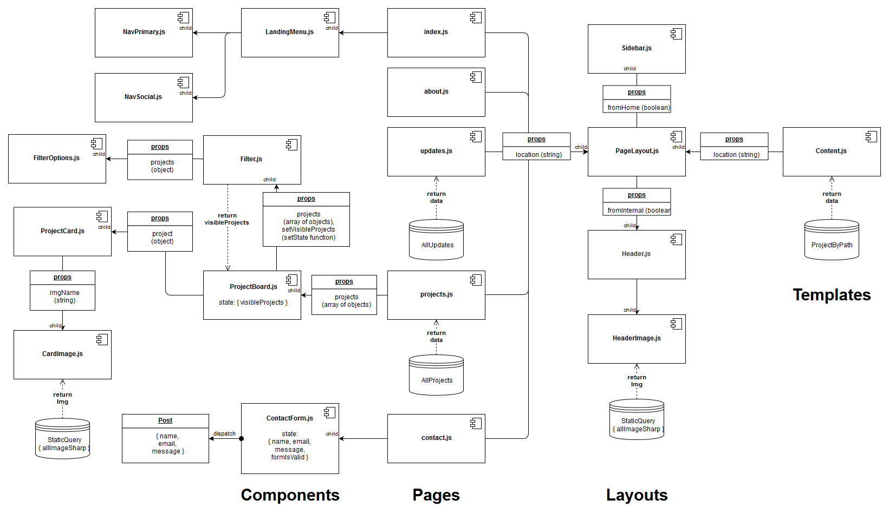
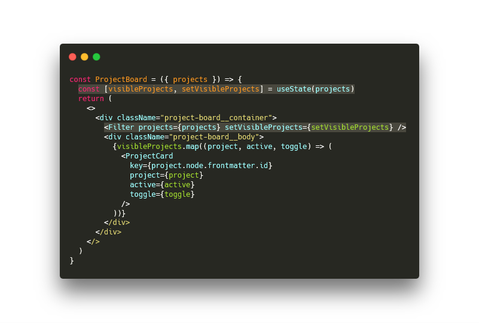
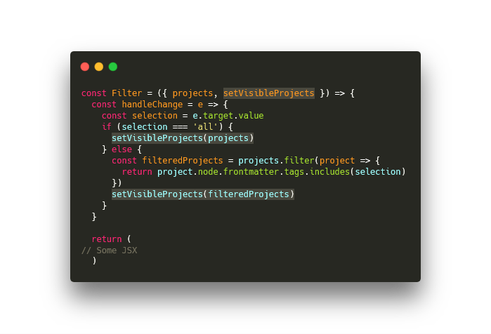
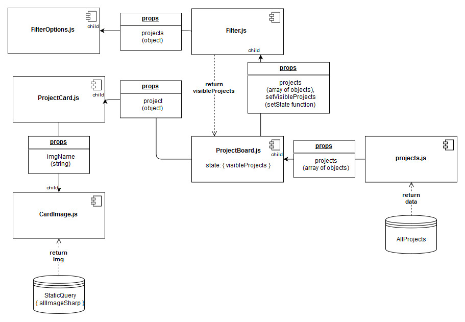
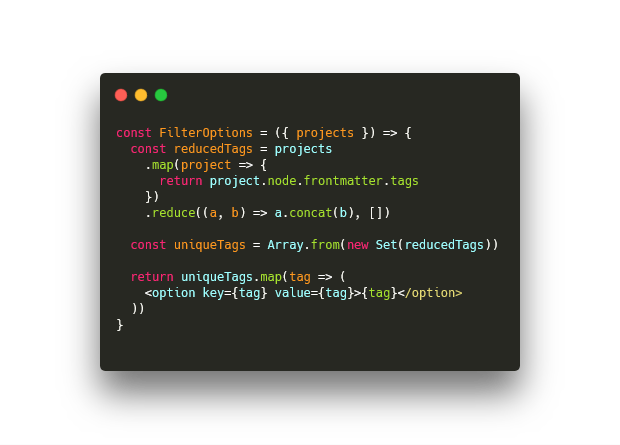
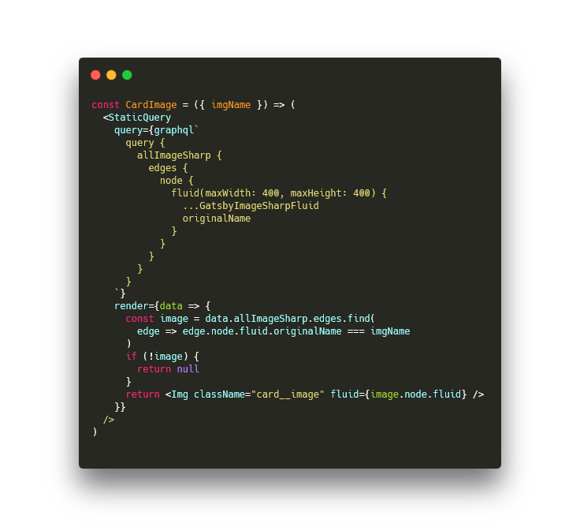

**Table of Contents:**
- [Introduction](#introduction)
- [UI components](#ui-components)
- [Project Page UI](#project-page-ui)
- [Handling queries in dynamically-generated UI components](#handling-queries-in-dynamically-generated-ui-components)
- [Repository](#repository)

## Introduction
cprimel.io is my professional portfolio website. It includes [a projects page](/projects) for quickly viewing, sorting and reading about projects I've worked on, [a blog](/updates) for updates and more detailed write-ups, a short [about page](/about), and a [contact form](/contact) for reaching out to me. The site is generated with [Gatsby.js](https://www.gatsbyjs.org), a framework for building static sites and progressive web apps built around the [React.js library](https://reactjs.org/) and a GraphQL API. The site's source code can be found in [the GitHub respository](https://github.com/cprimel/cprimelio).

The following breaks down the structure of the site's UI and addresses a current issue with how Gatsby.js deals with GraphQL queries in non-page components.[^1]


## UI components

The core strength of the React.js library lies in the modularity and composability it brings to UI development: individual pieces of the UI are encapsulated into components each of which, like pure functions, holds their own logic and state. This makes the UI easier to reuse, test and debug. These features also allow for a high degree of UI abstraction as evidenced by the diagram of this website's component structure below (click the image for more detail).



As the diagram also illustrates, components in React.js are structured hierarchically. Dataflows are unidirectional--passing down from parent to child components. Data which is relevant to the functioning of a component is kept in its local state and, if needed, a function can be passed to a child component to alter its parent's state without extending the parent's scope. For example, the latter pattern is used to link up the ```Filter``` and ```ProjectBoard``` components as shown below with the relevant code highlighted:





Here, ```ProjectBoard``` is passing down both ```projects``` and the function ```setVisibleProjects``` to its child component, ```Filter```. In turn, ```Filter``` is using ```setVisibleProjects``` to alter the state of its parent component, namely by setting ```visibleProjects``` in accordance to the user's selection via a dropdown menu.

## Project Page UI

The focal point of the site is the projects page. It is also the most complex portion of the UI composed of 6 components (1 of which is a stateful component), 2 seperate GraphQL queries, and the requisite dataflows between them. Here is a component diagram illustrating the UI hierarchy:



```projects.js``` is a page component primarily responsible for handling the GraphQL query which populates the page with data and handing it down to its child ```ProjectBoard``` component. State--in this case, the array of projects to be rendered to the page--is kept local to the ```ProjectBoard``` component. As mentioned above, it passes the ```projects``` array down to ```Filter``` as a prop along with the ```setVisibleProjects``` function that allows ```Filter``` to update ```ProjectBoard```'s local state. ```ProjectBoard``` maps through the ```visibleProjects``` array populating the page with the specified ```ProjectCard``` components passing each the respective project data as an object.

As detailed above, ```Filter``` controls what projects are visible on the page by altering its parent component's local state. Its sole child is ```FilterOptions``` which takes the ```projects``` array as a prop. ```FilterOptions``` maps through each project, extracts the tags array of each, and reduces them into an array of unique tags. Finally, it maps through the new array to generate options for the dropdown menu.



The ```ProjectCard``` component is generated dynamically based off of the filtered array of projects, ```visibleProjects```, contained in the local state of the ```ProjectBoard``` component. ```ProjectCard```'s sole child is ```CardImage``` which handles the retrieval of the project's placard image from the site data via the GraphQL API.

## Handling queries in dynamically-generated UI components

At present, Gatsby.js distinguishes between two types of GraphQL queries, normal queries that can accept variables but are only possible from page components and ```StaticQuery``` which cannot take variables--hence, the 'static' in ```StaticQuery```--but can be used in any component.[^2] The GraphQL query handled by ```CardImage``` component is of the latter variety. The rub is that ```CardImage``` is a dynamic component that needs to retrieve an image file based on a variable passed to it as a prop by its parent, ```ProjectCard```, but the only means of retrieving that image does not accept variables.

So, what's the solution? For the meantime, the community has suggested [a few workarounds.](https://spectrum.chat/gatsby-js/general/using-variables-in-a-staticquery~abee4d1d-6bc4-4202-afb2-38326d91bd05) In short, the ```Static Query``` is used to retrieve *the metadata and base64 encoded image for every image* and, then, the returned data is filtered for the requisite image.



As some have pointed out, this workaround could lead to performant issues for large, image-heavy sites as all the images and image metadata are downloaded and filtered on the client side. A feature to fix this problem has been proposed. See the proposal [here](https://github.com/gatsbyjs/gatsby/issues/10482).

## Repository

For the source code, check out the Github repository [here](https://github.com/cprimel/cprimelio).

[^1]: With Gatsby.js, it is necessary to provide page components which the framework uses to create pages for the static site. Most data queries occur at the page level with data being passed down as it is here from ```projects.js``` down the UI hierarchy. Its conventional to not capitalize the name of the page components to help distinguish them from regular React components that make up the UI.

[^2]: ```StaticQuery``` was introduced in Gatsby.js v2 as part of the phasing out of layout components. For an explanation, see the [request for comments](https://github.com/gatsbyjs/rfcs/blob/master/text/0002-remove-special-layout-components.md#detailed-design).
